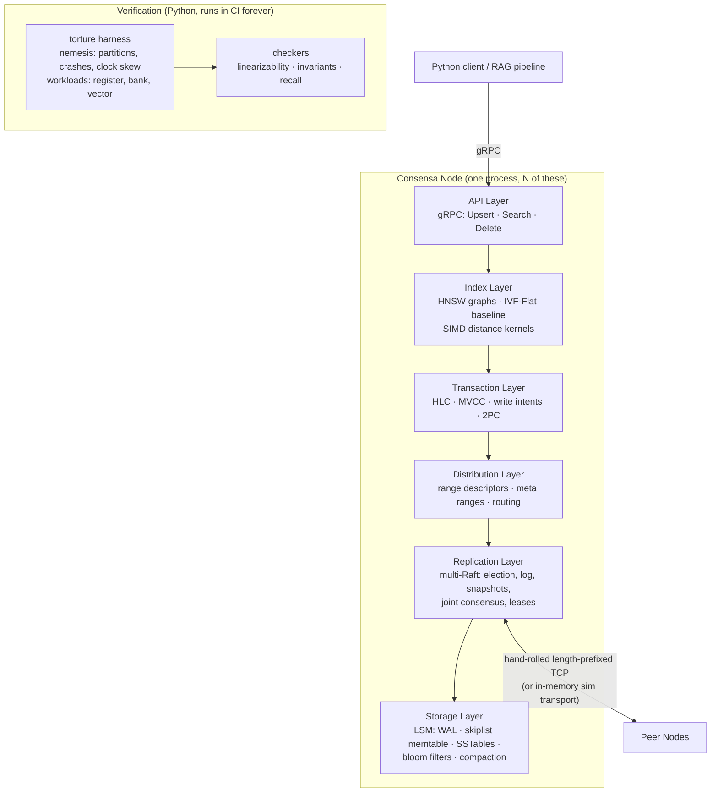

# Consensa — A Distributed Vector Storage Engine, Built From Scratch

> A sharded, Raft-replicated vector database in Go: LSM storage, consensus from the
> paper, MVCC transactions, HNSW approximate nearest-neighbour search, and a
> deterministic simulation harness that **proves** it correct under partitions, crashes,
> and clock skew.

This document is the complete build plan. It is written to be executed **one phase per
working session, one phase per pull request**, by a developer or an AI coding agent that
has read nothing else. Every phase states its dependencies, its exact file paths, its
interfaces, what to test, what "done" means, and — just as importantly — what **not** to
build yet.

---

## Table of Contents

- [North Star](#north-star)
- [Rules for implementing agents](#rules-for-implementing-agents)
- [The documentation standard](#the-documentation-standard)
- [Architecture](#architecture)
- [The engineering constitution](#the-engineering-constitution)
- [Repository layout](#repository-layout)
- [Ship gates](#ship-gates)
- [Phase 0 — Foundations & the simulator](#phase-0--foundations--the-simulator)
- [Phase 1 — LSM storage engine](#phase-1--lsm-storage-engine)
- [Phase 2 — Raft from the paper](#phase-2--raft-from-the-paper)
- [Phase 3 — Vector type & distance kernels](#phase-3--vector-type--distance-kernels)
- [Phase 4 — The HNSW index](#phase-4--the-hnsw-index)
- [Phase 5 — gRPC API & the RAG demo](#phase-5--grpc-api--the-rag-demo)
- [Phase 6 — The torture harness](#phase-6--the-torture-harness)
- [Phase 7 — Multi-Raft & range sharding](#phase-7--multi-raft--range-sharding)
- [Phase 8 — Distributed transactions](#phase-8--distributed-transactions)
- [Phase 9 — Leases & follower reads](#phase-9--leases--follower-reads)
- [Phase 10 — TLA+ specification](#phase-10--tla-specification)
- [Phase 11 — Joint consensus membership](#phase-11--joint-consensus-membership)
- [Phase 12 — Range splitting & HNSW repair](#phase-12--range-splitting--hnsw-repair)
- [Phase 13 — Observability & the demo](#phase-13--observability--the-demo)
- [Phase 14 — Serializable isolation](#phase-14--serializable-isolation)
- [Deliberate non-goals](#deliberate-non-goals)
- [Claims discipline](#claims-discipline)
- [Reading list](#reading-list)

---

## North Star

**One sentence:** a horizontally scalable vector database where you can upsert a million
embeddings over gRPC, run top-k similarity search, kill nodes and partition the network
mid-write, and *prove* — with a linearizability checker and invariant-verified chaos
tests — that nothing broke and recall held.

**The question this project answers better than any other portfolio project:**
*"How do you know it works?"*

Most distributed-systems side projects stop at "I ran it on three Docker containers and
it seemed fine." Consensa's answer: every Raft safety property, every transaction
invariant, and search recall itself are verified across thousands of seeded, replayable
fault-injection runs in CI. Correctness is a deliverable, not a hope.

**Success criteria, in priority order:**

1. **Correct** — verified, not assumed. A bug found by the torture harness is a success
   story; it gets a seed, a regression test, and a writeup in `docs/bugs/`.
2. **Understandable** — a strong engineer reads any package top-to-bottom in one sitting.
   This is a hard requirement, not an aspiration; see
   [the documentation standard](#the-documentation-standard).
3. **Honest** — limitations documented in the open: which isolation anomalies are
   permitted, what clock assumptions leases make, what the linearizability checker does
   and does not cover. Honesty about what a system does *not* do is senior-engineer signal.
4. **Fast enough to measure** — benchmarks exist to show *deltas* from design decisions
   (HNSW vs IVF-Flat, leader vs follower reads, Go vs assembly kernels), not to beat FAISS.

---

## Rules for implementing agents

Read this section before every phase. It is the contract.

1. **Build exactly one phase per session.** Each phase is one branch, one PR. Do not
   start the next phase's work "since it's related." Every phase has a **Do not build
   yet** list — honour it. Scope creep is the primary failure mode here.
2. **Check the dependencies line first.** If a listed prerequisite phase is not complete
   and merged, stop and say so rather than stubbing it.
3. **Do not invent designs this document does not specify.** Where a decision is open,
   this document says so explicitly and names the benchmark or criterion that settles it.
   If you hit a genuine gap, **stop and ask** — do not guess and proceed.
4. **The documentation standard is a Definition-of-Done item**, not a cleanup pass. A
   phase with working code and thin comments is *not* done. See the next section.
5. **Write `docs/notes/NN-<phase>.md` before opening the PR.** Five headings: why does
   this exist, how does it work, what alternatives existed, what tradeoff was made, what
   can fail. Plain language, roughly a page. This is the interview-prep artifact and it
   is mandatory.
6. **Dependency allowlist is closed.** Go: stdlib, `google.golang.org/grpc`,
   `google.golang.org/protobuf`, `github.com/prometheus/client_golang`. Python:
   `numpy`, `grpcio`, `hypothesis`, `pytest`. Nothing else without a new ADR explaining
   why building it teaches nothing. In particular: **no Raft library, no vector library,
   no FAISS, no skiplist package.** Building those *is* the project.
7. **Tests are part of the phase, not a follow-up.** Failure paths, not just happy paths.
8. **Conventional commits**, honest messages. The git history is part of the portfolio;
   `fix stuff` is not acceptable.
9. **Never fabricate a benchmark number.** Every number in a README or table comes from a
   committed, re-runnable benchmark. If something was not measured, say it was not
   measured.
10. **When the plan and your instinct disagree, follow the plan and note the
    disagreement in the PR description.** The plan encodes tradeoffs whose reasoning may
    not be visible from inside a single phase.

---

## The documentation standard

This project exists to be defended in a technical interview. **The target: the author can
reopen any file six months later and reconstruct the entire design argument from the
comments alone, without rereading the papers.**

**The core rule: comment the *why*, never the *what*.** `// increment the counter` is
worse than no comment — line-by-line narration is the loudest signal of a generated
codebase, and a reviewer who spots it discounts everything else in the file. What earns
credibility is the comment explaining the constraint you could not have guessed from
reading the code.

Four required layers:

**1. Package doc comment — a `doc.go` in every package.** Roughly half a page of plain
language: what this package is responsible for, the two or three key ideas, which paper
or system it comes from, and what it deliberately does *not* do. Someone should be able
to read only the `doc.go` files and understand the whole system.

**2. Doc comment on every exported type and function**, and on unexported ones whose
correctness is non-obvious. State the **invariant it maintains** and the **precondition
the caller owes it**:

```go
// resolveIntent determines the final fate of a provisional write left behind by another
// transaction, by reading that transaction's record.
//
// Precondition: the caller holds the range lease. Without it, two nodes can resolve the
// same intent against different views of the transaction record and commit divergent
// values — the intent is not the source of truth, the transaction record is.
func resolveIntent(...)
```

**3. Inline comments only where the code looks wrong until you know why.** Every subtle
line in this project has a reason some paper gave it. State the reason and cite the
source. The clear candidates: the Figure-8 commit rule, pre-vote, HLC skew handling,
HNSW neighbour selection, bounds-check-elimination reslicing, and the joint-consensus
dual-majority check.

```go
// Bad — narration. Says what the code already says.
// set the commit index to n
r.commitIndex = n

// Good — the constraint. Says what you cannot see.
// Only advance commitIndex for an entry from OUR current term. Raft §5.4.2 (Figure 8):
// an entry replicated on a majority is NOT necessarily committed if it came from an
// earlier term — a future leader can still legally overwrite it. Committing an entry
// from our own term implicitly commits everything before it, which is what makes this
// check safe rather than merely conservative.
r.commitIndex = n
```

**4. Every non-trivial test states what it proves**, in a comment above it. `TestFigure8`
should open with two lines naming the safety property that fails without it.

**Design choices bend toward legibility.** Where two designs are equally correct, take
the one that is easier to read and explain out loud. Specifically: no reflection, no code
generation beyond protobuf, no interface with a single implementation, no generics unless
they remove real duplication, and no clever concurrency where a plain loop works.

**Enforcement:** `golangci-lint` runs with `revive`'s exported-symbol rules enabled, so a
missing doc comment fails CI exactly like a bug. Then the check that actually matters, at
the end of every phase: reread the package cold and answer the five `docs/notes/`
questions out loud. If any answer requires opening the paper, the comments are not
finished and neither is the phase.

---

## Architecture



The layering is strict: each layer calls only the one below it. That discipline is what
keeps a codebase this size navigable.

**Two languages, one boundary, stated in one sentence:** *Go owns the data plane; Python
owns the verification and client plane.* Go: storage, consensus, ranges, transactions,
indexes, kernels, gRPC server. Python: torture orchestration, linearizability and
invariant checkers, recall and latency benchmarks, the RAG demo client. Both are
load-bearing; neither is decoration.

---

## The engineering constitution

Fixed for the life of the project. These rules exist to prevent the two failure modes of
ambitious side projects: quality rot and scope creep.

### 1. Deterministic simulation is the spine

Every component touching the network, the clock, or the disk is written against an
interface. Production wires them to real TCP, the wall clock, and disk; tests wire them
to an in-memory simulated network whose drops, delays, duplications, reorderings, and
clock skew are driven by a **seeded PRNG**.

**The Raft implementation is a pure state machine.** `Step(Message)` mutates state and
returns a `Ready` struct describing outbound messages, entries to persist, and entries to
apply. **No goroutines, no timers, no I/O, no channels inside the algorithm** — time
advances only via explicit `Tick()` calls. This is etcd's design, and it is what makes
determinism achievable in a language with a preemptive scheduler. The simulator drives N
such state machines and owns every delivery decision.

Consequences, and why this is the highest-leverage decision in the plan:

- A network partition during a leader election is a **unit test**, not a Docker exercise.
  It runs in milliseconds.
- Every chaos failure is **replayable from its seed**. "Fails under partition, sometimes"
  becomes "fails deterministically with seed 0x7C3A."
- CI runs thousands of randomized fault schedules nightly.

This is the methodology of FoundationDB and TigerBeetle. It is decided in Phase 0 because
it cannot be retrofitted.

### 2. The dependency allowlist

| Dependency | Purpose | Why not hand-built |
|---|---|---|
| `google.golang.org/grpc` + `protobuf` | **client-facing** API only | Wire-format and codegen plumbing; teaches nothing distributed. Internal Raft traffic does *not* use it — see below. |
| `prometheus/client_golang` | metrics | The ecosystem standard; hand-rolling it teaches nothing. |
| `numpy` (Python harness) | ground-truth brute-force search | Reference implementation for recall checking; must be independent of the Go code it validates. |
| `hypothesis` (Python harness) | property-based testing | Best-in-class; nothing equivalent in stdlib. |

**Everything else is stdlib or hand-built**: the peer transport framing, the skiplist,
the LSM, the HLC, Raft, HNSW, IVF-Flat, and the distance kernels. Building those *is* the
project.

**On gRPC, because this will be challenged:** gRPC is the **client-facing API only**.
Internal peer-to-peer Raft traffic runs on a hand-rolled length-prefixed transport,
because the simulator must be able to drop, delay, duplicate, and reorder every single
message — a framework transport would hide exactly the machinery that must be controlled.
The boundary is: anything crossing between nodes is hand-built; anything crossing to a
user is gRPC. ADR-003 records this.

### 3. MVCC key encoding from day one

Storage keys are `user_key ++ reverse-encoded-HLC-timestamp` starting in **Phase 1**,
even though transactions do not arrive until Phase 8. Retrofitting versioned keys into a
live LSM engine is a rewrite; encoding them early costs one design session. Reverse-encoded
so a forward scan finds the *newest* version of a key first.

### 4. Verification and observability are exit criteria, not phases

- Linearizability checking enters CI at Phase 2 and never leaves.
- Recall checking enters CI at Phase 4 and never leaves.
- Every phase's Definition of Done includes its Prometheus metrics.

### 5. Process discipline

- **CI on every push:** `go vet`, `golangci-lint`, `go test -race`, `pytest`. Nightly:
  the torture harness across fresh seeds. Go *does* have a data-race bug class, so the
  race detector earns its place.
- **One branch per phase**, merged via PR with a self-review pass.
- **ADRs** (`docs/adr/NNN-title.md`) for every decision someone could challenge in an
  interview.
- **Comments state constraints, not narration.** See
  [the documentation standard](#the-documentation-standard).

---

## Repository layout

```
consensa/
├── cmd/
│   ├── consensa/                  # node entry point
│   └── consensa-cli/              # admin CLI: range inspection, membership ops
├── internal/
│   ├── sim/                       # P0: seeded scheduler, sim transport, fake clock
│   ├── storage/                   # P1: WAL, skiplist memtable, SSTables, compaction
│   ├── raft/                      # P2: pure state machine — Step(msg) → Ready
│   ├── vector/                    # P3: vector type, distance kernels
│   ├── ann/                       # P4: HNSW, IVF-Flat, persistence, split repair
│   ├── server/                    # P5: gRPC service implementation
│   ├── kv/                        # P7: ranges, multi-raft, routing, split/merge
│   ├── txn/                       # P8: HLC, MVCC, intents, 2PC
│   └── metrics/                   # Prometheus registration helpers
├── api/consensa/v1/               # P5: .proto definitions + generated code
├── harness/                       # Python: torture, checkers, benchmarks, RAG demo
│   ├── torture/                   # P6: workloads, nemesis, checkers, CLI
│   ├── bench/                     # P3+: recall, latency, throughput harnesses
│   └── demo/                      # P5: RAG demo client
├── specs/                         # P10: TLA+ specifications
├── docs/
│   ├── adr/                       # architecture decision records
│   ├── notes/                     # per-phase study notes (mandatory)
│   ├── bugs/                      # one file per harness-found bug
│   └── correctness.md             # the "how do you know it works" document
├── deploy/                        # docker-compose cluster + Prometheus + Grafana
├── Makefile
└── PLAN.md
```

---

## Ship gates

The failure mode of a plan this size is being nine months in with nothing to show. Honest
totals at 15–20 hrs/week are **14–18 months for everything** — phase estimates below
assume each phase lands right the first time, and Phase 2 usually does not.

So there are three gates. **Each is independently resume-complete.** The README,
benchmark tables, and `correctness.md` get written *at each gate*, not saved for the end.

| Gate | Phases | Realistic | Claimable |
|---|---|---|---|
| **G1 — Replicated vector store** | 0–6 | ~4–5 months | Raft from scratch + HNSW + gRPC, linearizability- and recall-verified under chaos |
| **G2 — Distributed** | 7–9, 12 | +4–5 months | Sharded, transactional, split-aware. The HNSW-under-split work is the differentiator |
| **G3 — Depth** | 10, 11, 13, 14 | +3–4 months | Joint consensus, TLA+, full observability, serializability |

**G1 deliberately has no sharding and no transactions.** A single-range, 3-node
replicated vector store with a real Raft, a real HNSW, and a real proof already beats
almost everything it competes with, and it is reachable this year. **Do not start Phase 7
until G1 is on GitHub with a README and a demo.**

Phase order note: the index work (Phases 3–4) comes *before* sharding deliberately, so
that G1 is a working product rather than an unusable half-database.

---

# Part I — The Core (G1)

## Phase 0 — Foundations & the simulator

**Dependencies:** none. **Effort:** ~1 week.

**Goal:** make the constitution physically real before any feature code exists.
Retrofitting CI, lint, or the simulator onto a grown codebase never happens.

**Files to create:**

```
go.mod                              # module github.com/<user>/consensa
Makefile                            # test, lint, race, bench, torture
.github/workflows/ci.yml            # vet + lint + test -race + pytest on push
.github/workflows/nightly.yml       # torture across fresh seeds (hook only for now)
.golangci.yml                       # revive exported-symbol rules ON
internal/sim/doc.go
internal/sim/clock.go
internal/sim/transport.go
internal/sim/scheduler.go
internal/sim/sim_test.go
docs/adr/001-go-over-python.md
docs/adr/002-deterministic-simulation.md
docs/adr/003-dependency-allowlist.md
docs/notes/00-foundations.md
.gitignore
```

**Interfaces to define** (these are load-bearing for every later phase):

```go
// NodeID identifies a node for the lifetime of a cluster.
type NodeID uint64

// Transport delivers messages between nodes. Production wires this to TCP; tests wire it
// to the simulator, which decides delivery order from a seed.
type Transport interface {
    Send(to NodeID, msg []byte) error
    Recv() ([]byte, NodeID, error)
}

// Clock is the only source of time in the system. Nothing calls time.Now() directly —
// that is what makes replay possible.
type Clock interface {
    Now() time.Time
    // Tick advances logical time. In production this is driven by a real ticker; in the
    // simulator the scheduler calls it, which is why timeouts are deterministic.
    Tick()
}

// Scheduler owns every delivery decision in a simulated cluster. Given the same seed it
// produces a byte-identical schedule, which is what makes a failing run replayable.
type Scheduler struct { /* seeded PRNG, pending message queue, per-node clocks */ }

// Fault configuration the scheduler applies.
type Faults struct {
    DropRate      float64
    DuplicateRate float64
    MaxDelay      time.Duration
    Partitions    [][]NodeID  // each group can talk only within itself
    ClockSkew     map[NodeID]time.Duration
}
```

**ADR content to write:**

- **ADR-001, Go over Python.** State the reasoning plainly: the pure-state-machine Raft
  design gives stronger determinism than an event-loop language, single-binary deployment
  matters for the demo, and Go is the target roles' language. Also state the cost
  honestly — this reverses an earlier decision, and prior Python storage-engine work is
  discarded. A reversal with reasoning reads as judgement; a silent one reads as drift.
- **ADR-002, deterministic simulation.** Why no goroutines inside the algorithm; how
  `Step`/`Ready` works; why time is explicit.
- **ADR-003, dependency allowlist,** including the gRPC boundary (client-facing only).

**Tests:**

- Two simulated nodes exchange messages under a fixed seed. Record the full delivery
  schedule. Run 100 times. Assert byte-identical every time. **This test is the
  foundation of every correctness claim in the project** — say so in its comment.
- Fault injection unit tests: drop rate, delay bound, and partition isolation each do
  what they claim.

**Definition of Done:**
- [ ] CI green on push; nightly workflow exists and runs (trivially).
- [ ] `golangci-lint` fails the build on a missing exported doc comment — verify by
      deliberately removing one.
- [ ] 100-run identical-schedule test passes.
- [ ] Three ADRs and `docs/notes/00-foundations.md` written.

**Do not build yet:** storage, Raft, anything vector-related, any networking beyond the
sim transport interface.

---

## Phase 1 — LSM storage engine

**Dependencies:** Phase 0. **Effort:** ~3 weeks.

**Goal:** the per-node storage engine — the durable foundation everything else writes to.

**Files to create:**

```
internal/storage/doc.go
internal/storage/wal.go             # segmented, CRC'd, idempotent replay
internal/storage/skiplist.go        # hand-built ordered in-memory map
internal/storage/memtable.go
internal/storage/sstable.go         # block-based: data, sparse index, bloom, footer
internal/storage/bloom.go
internal/storage/compaction.go      # size-tiered
internal/storage/mvcc_key.go        # user_key ++ reverse-encoded HLC
internal/storage/engine.go          # the public Engine type
internal/storage/*_test.go
docs/adr/004-size-tiered-compaction.md
docs/notes/01-storage.md
```

**What to build:**

- **WAL** — segmented, length-prefixed, CRC32-checksummed records; explicit fsync policy
  behind a `SyncEvery` knob; rotation after memtable flush; **idempotent replay** (a
  partial trailing record is truncated, not an error — a crash mid-write is normal, not
  corruption, and the comment should say so).
- **Skiplist memtable** — hand-built. Go's stdlib has no ordered map, and a skiplist
  gives ordered iteration and is a classic interview structure. Probabilistic level
  assignment; document the expected-O(log n) argument in the package doc.
- **SSTable** — immutable, block-based: data blocks (~4KB), a sparse index block holding
  the first key of each data block, a bloom filter block, and a footer with the offsets.
  Read path: bloom check → binary search the sparse index → scan exactly one block.
- **Size-tiered compaction only.** ADR-004 records why leveled is deferred: per-node data
  volume in a sharded database stays bounded by range splitting (Phase 12), so leveled's
  write-amplification tradeoff buys nothing at this scale. This is the anti-fluff rule in
  action — write the reasoning down so the omission reads as a decision.
- **MVCC key encoding** (constitution §3): comparator, encoder, decoder, and an iterator
  exposing "newest version of key K with timestamp ≤ T". Used trivially now, critically
  in Phase 8.

```go
// Engine is a single-node ordered key-value store. It is not safe for concurrent use by
// multiple writers; the layer above serialises writes through Raft, which is what lets
// this code stay simple.
type Engine interface {
    Put(key []byte, ts HLC, value []byte) error
    // Get returns the newest version of key at or below ts. Returns ErrNotFound if no
    // such version exists — note that a deletion tombstone is a version, not an absence.
    Get(key []byte, ts HLC) ([]byte, error)
    Delete(key []byte, ts HLC) error
    Scan(start, end []byte, ts HLC) Iterator
    Flush() error
    Close() error
}
```

**Tests:**

- **Property-based** (Go's `testing/quick` or a hand-rolled generator): random operation
  sequences against a model `map`, compared after every operation, including across
  simulated restarts.
- **Crash recovery at every fsync boundary.** Inject a failure point into the fsync path,
  kill, reopen, and assert: no acknowledged write is lost, and no torn record surfaces.
  Iterate the failure point across every boundary in a write. This suite is a signature
  piece of the project — comment it accordingly.
- **Benchmarks**, committed to `docs/`: sequential and random write throughput,
  point-read latency with and without the bloom filter. This table is the "before" for
  every later performance claim.

**Definition of Done:**
- [ ] Property suite green across 10k randomized sequences.
- [ ] Kill-at-every-fsync-boundary suite green.
- [ ] Benchmark table committed.
- [ ] Metrics registered: write/read/flush/compaction counters and latency histograms.
- [ ] `docs/notes/01-storage.md` written.

**Do not build yet:** replication, transactions, vectors. The engine stores opaque bytes.

---

## Phase 2 — Raft from the paper

**Dependencies:** Phases 0, 1. **Effort:** ~4–5 weeks. **This is the make-or-break phase
— do not rush it. Everything above sits on it.**

**Goal:** consensus, implemented from the extended Raft paper, not ported from etcd.

**Files to create:**

```
internal/raft/doc.go
internal/raft/state.go              # term, vote, log, indices — the raw state
internal/raft/log.go                # entries, matching, truncation
internal/raft/election.go           # timeouts, votes, pre-vote
internal/raft/replication.go        # AppendEntries, commit advancement
internal/raft/snapshot.go           # InstallSnapshot, log truncation
internal/raft/node.go               # Step(msg) → Ready — the public surface
internal/raft/storage.go            # persistence via internal/storage
internal/raft/*_test.go
harness/torture/checker/linearizability.py
docs/notes/02-raft.md
```

**Build in this order — each step must pass its tests before the next begins:**

1. **Leader election** — terms, randomized timeouts, vote safety. **Plus pre-vote**
   (Raft thesis §9.6): without it, a partitioned node rejoins with an inflated term and
   deposes a healthy leader. It is ~50 lines and prevents a real availability bug.
2. **Log replication** — AppendEntries, the consistency check, commit-index advancement,
   and the **Figure 8 commitment rule**: never commit an entry from a prior term by
   counting replicas. This is the paper's subtlest trap. There will be a `TestFigure8`
   that fails if the rule is weakened.
3. **Persistence** — term, vote, and log durably on the Phase 1 engine before any
   response is sent. Crash-restart is a first-class simulator event from the start.
4. **Snapshots** — InstallSnapshot RPC, log truncation, restore on restart.
5. **The state machine interface** — `Apply(entry) → result`, so later phases plug in.

```go
// Ready describes everything the caller must do as a result of one or more Step calls.
// The algorithm performs no I/O itself: it returns intentions and the caller executes
// them. This is what keeps Raft deterministic and testable without a network.
type Ready struct {
    HardState        HardState  // term/vote/commit — MUST be persisted before Messages are sent
    Entries          []Entry    // MUST be appended to the log before Messages are sent
    Snapshot         Snapshot
    CommittedEntries []Entry    // safe to apply to the state machine
    Messages         []Message  // send only AFTER HardState and Entries are durable
}

// Node is a single Raft replica. It is a pure state machine: no goroutines, no timers,
// no I/O. Time advances only through Tick.
type Node interface {
    Step(m Message) error
    Tick()
    Propose(data []byte) error
    Ready() Ready
    Advance()   // caller confirms it has persisted and sent everything in the last Ready
}
```

> The ordering constraint in `Ready` — persist before send — is the single easiest thing
> to get wrong in a Raft implementation and the hardest bug to find later. Comment it at
> the definition **and** at the call site.

**Tests — this is where the project starts separating itself:**

- **Seeded chaos:** thousands of schedules with random partitions, crash-restarts,
  message drops and reorders, and clock skew. After **every step**, assert the paper's
  five safety properties: Election Safety, Leader Append-Only, Log Matching, Leader
  Completeness, State Machine Safety.
- **`TestFigure8`** — construct the specific interleaving where an entry replicated on a
  majority is later overwritten. Assert the commit rule prevents it.
- **Linearizability checking enters CI.** Run a 3-node replicated register under chaos,
  record the concurrent client history, export it as JSON, and check it in the Python
  harness. Implement the check as a Wing-Gong-style search over candidate linearizations
  with memoisation — the histories here are small enough for that to be practical, and
  writing it means you can explain what linearizability *is* rather than citing a tool.
  This check never leaves the repo.

**Definition of Done:**
- [ ] Five safety properties hold across ≥10,000 seeded chaos runs in nightly CI.
- [ ] Linearizability verified for the replicated register under partitions.
- [ ] `TestFigure8` exists and fails if the commitment rule is weakened — verify by
      weakening it deliberately, watching the test fail, then reverting.
- [ ] Metrics: per-node term, commit index, applied index, election count, heartbeat RTT.
- [ ] `docs/notes/02-raft.md` written — this is the most important notes file in the
      project.

**🏁 Independently shippable checkpoint:** a linearizable replicated key-value store,
with proof. Most Raft side projects stop here, without the proof.

**Do not build yet:** multiple Raft groups, ranges, transactions, membership changes.
One Raft group over the whole keyspace is correct for now.

---

## Phase 3 — Vector type & distance kernels

**Dependencies:** Phase 1. **Effort:** ~2 weeks.

**Goal:** make vectors first-class values in the storage engine, with fast, correct
distance functions.

**Files to create:**

```
internal/vector/doc.go
internal/vector/vector.go           # type, encoding, validation
internal/vector/distance.go         # L2, inner product, cosine — pure Go
internal/vector/distance_amd64.s    # OPTIONAL, timeboxed — see below
internal/vector/distance_amd64.go   # OPTIONAL — build tag + CPU feature detection
internal/vector/*_test.go
harness/bench/kernels.py            # NumPy reference for fuzz comparison
docs/notes/03-vector.md
```

**What to build:**

- **`Vector`** — a fixed-dimension `[]float32` with a compact length-prefixed encoding
  into LSM value bytes. Dimension is fixed per collection and validated at write time;
  a dimension mismatch is a client error, never a silent truncation.
- **Distance kernels** in idiomatic Go, written to be compiler-friendly: 8-wide manual
  unrolling, bounds-check elimination via slice reslicing before the loop, `float32`
  accumulators. Verify the bounds checks actually disappeared with
  `go build -gcflags=-d=ssa/check_bce/debug=1`, and note in the comment *why* the
  reslicing is written that way — it looks pointless otherwise, which is exactly the case
  the documentation standard exists for.

```go
// L2Squared returns the squared Euclidean distance between a and b.
//
// Squared, not the actual distance: the square root is monotonic, so it cannot change
// the ordering of nearest neighbours, and skipping it removes a sqrt from the innermost
// loop of every search. Callers that need true distance take the root once, at the end.
//
// Precondition: len(a) == len(b). Callers validate dimension at the API boundary, so
// this does not re-check it on a hot path.
func L2Squared(a, b []float32) float32
```

- **Optional, timeboxed to one week: one AVX2 kernel** (L2, dimension a multiple of 8) in
  Go assembly behind a build tag, with runtime CPU feature detection and a scalar
  fallback. Go's Plan 9 assembly syntax is genuinely unpleasant and thinly documented;
  this is the lowest payoff-per-hour item in the plan. **If the week runs out, cut it and
  say so in the notes.** The benchmark table is the deliverable either way — an honest
  *"the Go compiler got within 20% and the assembly was not worth maintaining"* is a
  better interview answer than a heroic one.

**Tests:**

- **Fuzz against NumPy.** Generate random vectors, compute distances in both Go and
  NumPy, assert agreement within a documented float32 tolerance. The reference must be
  independent of the code it validates — that is the whole point of using a different
  language for it.
- Edge cases: zero vectors (cosine is undefined — decide and document the behaviour),
  dimension mismatch, denormals, very large magnitudes.
- Benchmarks at dim 128 / 768 / 1536 (the dimensions real embedding models produce):
  ns/op and effective GB/s, committed as a table.

**Definition of Done:**
- [ ] Fuzz comparison against NumPy green.
- [ ] Bounds-check elimination confirmed and documented.
- [ ] Benchmark table committed; if the assembly path exists, both rows are present.
- [ ] `docs/notes/03-vector.md` written.

**Do not build yet:** any index. This phase is types and arithmetic only.

---

## Phase 4 — The HNSW index

**Dependencies:** Phases 1, 2, 3. **Effort:** ~4 weeks.

**Goal:** approximate nearest-neighbour search that is fast, measurably accurate, and
survives crashes and Raft snapshot restore.

**Files to create:**

```
internal/ann/doc.go
internal/ann/hnsw.go                # graph structure, insert, search
internal/ann/heap.go                # candidate/result heaps
internal/ann/ivfflat.go             # baseline for comparison
internal/ann/persist.go             # Raft-logged graph mutations
internal/ann/*_test.go
harness/bench/recall.py             # ground truth + recall@k sweeps
docs/adr/005-hnsw-persistence.md
docs/notes/04-hnsw.md
```

**What to build — HNSW, following Malkov & Yashunin (2016):**

- Hierarchical layers with geometric level assignment (`level = floor(-ln(U) * mL)`).
- Greedy search descending layer by layer; at layer 0, a best-first search maintaining a
  dynamic candidate list of size `efSearch`.
- **The neighbour-selection heuristic (Algorithm 4), not naive top-M.** This matters:
  naive selection produces clustered neighbourhoods and recall collapses in high
  dimensions, because the graph loses long-range links. Knowing this difference is a
  large part of the interview value of the phase — the comment must explain *why* the
  heuristic keeps a diverse neighbourhood, not just that it does.
- Parameters: `M`, `efConstruction`, `efSearch`, all configurable, with the defaults'
  reasoning documented.

**Persistence — the hard half, and the part most implementations skip. The decision is
made: log graph mutations as Raft entries.** Every insert produces a deterministic set of
edge changes that go into the Raft log, so **every replica's graph is bit-identical**.
The alternative — rebuilding the graph from MVCC data on apply — yields a smaller log but
requires proving that rebuild is deterministic across replicas, and identical replicas
are what make follower reads (Phase 9) trivially correct. ADR-005 records both options
and this reasoning. The cost is a larger Raft log, mitigated by snapshots.

**Also build IVF-Flat** — coarse k-means centroids, inverted lists, probe the `nProbe`
nearest lists. It is a few hundred lines and it exists so that "why HNSW?" is answered
with a measured curve instead of a citation.

**Tests:**

- **Recall harness** (`harness/bench/recall.py`): brute-force ground-truth top-k over a
  real embedding set (SIFT-1M, or a Wikipedia embedding dump), then recall@10 versus
  latency curves swept over `efSearch`. **Recall is a correctness metric here and is
  tracked in CI like any other.**
- **Make the recall gate deterministic or it will be disabled within a month.** HNSW's
  level assignment is randomized, so a bare `recall >= 0.95` assertion on a fresh build
  is a flake generator — and a flaky gate is a gate you learn to ignore. Pin the RNG
  seed, pin a fixed dataset slice and a fixed query set, and assert against a
  **committed baseline with a tolerance band**: fail on a drop below the band, and *flag
  but do not fail* on an unexplained improvement, which usually means the ground truth
  broke.
- **Crash and snapshot survival:** build an index, crash at various points, reopen,
  assert recall is unchanged. Then restore a replica from a Raft snapshot and assert its
  graph is byte-identical to the leader's.

**Definition of Done:**
- [ ] recall@10 ≥ 0.95 at a documented `efSearch` on a real dataset.
- [ ] Index survives crash-restart and snapshot restore with recall unchanged.
- [ ] Replica graphs verified bit-identical after replication.
- [ ] HNSW vs IVF-Flat vs brute-force table committed (recall, latency, memory).
- [ ] Metrics: index size, insert latency, search latency histogram, recall gauge.
- [ ] `docs/notes/04-hnsw.md` written.

**Do not build yet:** sharding-aware index behaviour, filtered search, quantization.
One index per node over one Raft group is correct for now.

---

## Phase 5 — gRPC API & the RAG demo

**Dependencies:** Phases 2, 4. **Effort:** ~2 weeks.

**Goal:** a real client-facing API, and the demo that makes the project legible to a
reviewer in thirty seconds.

**Files to create:**

```
api/consensa/v1/consensa.proto
internal/server/doc.go
internal/server/service.go          # gRPC service implementation
internal/server/*_test.go
cmd/consensa/main.go                # node entry point: flags, wiring, serve
harness/demo/rag.py                 # embed → upsert → query, under failover
harness/demo/README.md
docs/notes/05-api.md
```

**Service definition:**

```protobuf
service Consensa {
  // Upsert streams batches of vectors. Client-streaming because bulk ingest is the
  // dominant write pattern for a vector store and per-vector RPCs waste round trips.
  rpc Upsert(stream UpsertRequest) returns (UpsertResponse);

  // Search returns the k nearest neighbours. Server-streaming so a large k starts
  // arriving before the whole result set is assembled.
  rpc Search(SearchRequest) returns (stream SearchResult);

  rpc Delete(DeleteRequest) returns (DeleteResponse);
  rpc BatchGet(BatchGetRequest) returns (BatchGetResponse);

  // Admin surface, also used by the torture harness to drive fault injection.
  rpc Status(StatusRequest) returns (StatusResponse);
}
```

`SearchRequest` carries the query vector, `k`, an optional `ef` override (so a caller can
trade latency for recall per-query), and an optional metadata filter. Write the
`.proto` comments to the same standard as the Go code — the proto file is API
documentation, and it is what a reviewer opens first.

**The RAG demo** (`harness/demo/rag.py`): embed a document corpus, upsert it into a
3-node Consensa cluster, answer queries by retrieving top-k — **while a node is being
killed**. This artifact is what makes the project instantly legible to an
AI-infrastructure reviewer, so it gets real attention, not a stub.

**Tests:**
- Round-trip: upsert a corpus, search, compare against brute force.
- A search issued during a leader failover returns correct results or a clean retryable
  error — never a wrong result, never a hang.
- Malformed input at the boundary: wrong dimension, k ≤ 0, empty vector, oversized batch.
  Every one gets a specific error, not a panic.

**Definition of Done:**
- [ ] End-to-end RAG query answered correctly across an induced leader failover with zero
      lost writes.
- [ ] Throughput table committed: batch upsert QPS, search p50/p99 at 1M vectors.
- [ ] `docs/notes/05-api.md` written.

**Do not build yet:** authentication, rate limiting, TLS, multi-tenancy. They are
[explicit non-goals](#deliberate-non-goals).

---

## Phase 6 — The torture harness

**Dependencies:** Phases 2, 4, 5. **Effort:** ~2–3 weeks to assemble; permanent after.

**Goal:** consolidate per-phase verification into one weaponized harness, and write the
document that answers *"how do you know?"*

**Files to create:**

```
harness/torture/__init__.py
harness/torture/cli.py              # torture run / torture replay
harness/torture/workload/register.py
harness/torture/workload/vector.py
harness/torture/nemesis.py
harness/torture/checker/linearizability.py   # from Phase 2
harness/torture/checker/invariant.py
harness/torture/checker/recall.py
harness/torture/history.py          # record + replay failing histories
docs/correctness.md
docs/bugs/README.md
docs/notes/06-torture.md
```

**What to build:**

- **Workloads:** `register` (linearizability), `vector` (after chaos, every ANN result
  set must be a subset of brute-force ground truth over committed data, and recall must
  hold within its band).
- **Nemesis:** partitions (random bisection, asymmetric, partial), crash-restart (clean
  and abrupt), clock skew and jumps, and — because deterministic simulation makes it free
  — **combined schedules**: a partition *during* a leader transfer *during* a restart.
- **History recorder** that dumps any failing history alongside its seed.
- **CLI:** `torture run --workload vector --nemesis partition,crash --seeds 1000` and
  `torture replay --seed 0x7C3A`.
- **Nightly CI matrix** across workloads × nemeses; a failure files an issue with the seed.

**Two documents, and they matter more than any feature:**

- **`docs/correctness.md`** — the flagship, written in the form of a Jepsen report:
  properties checked, run counts, faults injected, what held, and what is
  known-anomalous. State plainly what the linearizability checker covers (the KV register
  histories) and what it does not (search result quality — that is the recall checker's
  job). See [claims discipline](#claims-discipline).
- **`docs/bugs/`** — one file per real bug the harness found: seed, minimal repro, root
  cause, fix, and the regression test. **This is the highest-value artifact in the
  repository.** It is the closest a personal project gets to production incident
  experience, and it is the difference between claiming rigor and demonstrating it. Write
  an entry for every genuine bug, including the embarrassing ones — especially those.

**Definition of Done:**
- [ ] Full matrix green across ≥5,000 fresh seeds.
- [ ] **The harness itself is tested:** deliberately inject a bug (weaken Figure-8), and
      confirm the harness catches it within the nightly budget. Revert afterward and keep
      the experiment documented.
- [ ] `docs/correctness.md` committed.
- [ ] `docs/notes/06-torture.md` written.

**🏁 G1 COMPLETE.** Before starting Phase 7: write the README (architecture diagram, demo
GIF, all benchmark tables, links to `correctness.md` and the ADRs), push it, and start
applying with it on the resume.

---

# Part II — Distribution (G2)

## Phase 7 — Multi-Raft & range sharding

**Dependencies:** G1 complete. **Effort:** ~2–3 weeks.

**Goal:** horizontal scale. One Raft group per range of the keyspace; a node hosts
replicas of many ranges.

**Files:** `internal/kv/{doc.go,descriptor.go,meta.go,multiraft.go,router.go}` + tests,
`docs/notes/07-multiraft.md`.

**What to build:**

- **Range descriptors** — `[start_key, end_key) → replica set`, stored **as data in meta
  ranges**. This is the addressing trick from Bigtable and CockroachDB: range metadata
  lives in the database itself, bootstrapped from a fixed root descriptor. Explain the
  recursion and its base case in the package doc; it is the part people find confusing.
- **Multi-Raft multiplexing** — every range on a node shares one transport, one storage
  engine, one Raft scheduler. **Batched heartbeats across ranges**: 1,000 ranges must not
  mean 1,000× the heartbeat traffic. This is *the* multi-Raft problem; naming and solving
  it is the point of the phase.
- **Routing** — client request → cached meta-range lookup → range leader; retry on a
  stale descriptor (`RangeKeyMismatch`).
- **Static splits only.** Ranges are created by admin command at fixed keys. Dynamic
  splitting is Phase 12 — sharding *mechanics* and split *policy* are separate problems,
  built separately.

**Definition of Done:**
- [ ] A 3-node cluster serves a keyspace across ≥8 ranges; torture stays green with
      routing in the path.
- [ ] Descriptor cache invalidation proven by a test that moves a range and watches a
      stale client recover.
- [ ] Metrics: per-range leader, size, QPS; heartbeat batch sizes.

**Do not build yet:** dynamic splitting, merging, membership changes, index-aware
sharding.

---

## Phase 8 — Distributed transactions

**Dependencies:** Phase 7. **Effort:** ~4–5 weeks.

**Decide before starting, and record it either way.** With no SQL layer, the only
operation that genuinely needs multi-range atomicity is a batch upsert spanning ranges,
and cheaper answers exist. Counter-argument, which is strong: this is excellent interview
material, and it is what makes Phase 14's write-skew narrative possible. **Look at the
code, make the call, and write the ADR.** Do not build it by inheritance.

If building: **simplified CockroachDB model.**

**Files:** `internal/txn/{doc.go,hlc.go,mvcc.go,intent.go,coordinator.go}` + tests,
`docs/adr/006-snapshot-isolation.md`, `docs/notes/08-transactions.md`.

- **Hybrid Logical Clocks** — causality-safe under bounded clock skew, ~150 lines, tested
  under simulated skew.
- **MVCC** — reads at a snapshot timestamp see the newest version ≤ T. The Phase 1 key
  encoding pays off here: zero storage changes required.
- **Write intents** — provisional versions carrying a pointer to their transaction
  record. A reader encountering an intent resolves it against that record: committed →
  treat as value; aborted → ignore; pending → push or wait.
- **Transaction records + 2PC** — the record, on the transaction's first-written range,
  is the atomic commit point. Commit is **one Raft write** flipping `PENDING` →
  `COMMITTED`; intent resolution afterward is asynchronous cleanup. Coordinator crash
  mid-commit is therefore safe *by construction*, and there is a torture scenario proving
  it.
- **Isolation: snapshot isolation, stated honestly** (ADR-006). SI admits **write skew**,
  and this phase ships a test that *reproduces the anomaly reproducibly*, checked in as
  documentation-by-test. It flips polarity in Phase 14. Shipping a known gap with a test
  that demonstrates it is a stronger signal than quietly claiming serializability.

**Definition of Done:**
- [ ] Bank workload in torture: N accounts, concurrent transfers, nemesis active; the
      total-balance invariant holds at every read; no transfer half-applies.
- [ ] Coordinator killed between record-commit and intent resolution: readers still
      converge on the committed values.
- [ ] Write-skew anomaly test reproduces under SI and is documented as expected.
- [ ] Metrics: commits/aborts/restarts, intent-resolution queue depth, conflict rate,
      commit latency histogram.

---

## Phase 9 — Leases & follower reads

**Dependencies:** Phase 7. **Effort:** ~2 weeks.

**Goal:** the read path, built as a correctness ladder. Each rung removes cost; each
rung's safety argument is written down.

**This matters more for a vector store than for OLTP:** ANN search is read-heavy and
CPU-bound, so serving searches from followers is the difference between one node's
throughput and the cluster's. That is the benchmark to lead with.

Build in order:

1. **ReadIndex** — the leader confirms leadership with a heartbeat round before serving a
   read. Correct with **zero clock assumptions**. This is the fallback whenever leases are
   in doubt.
2. **Leader leases** — time-bounded leadership under a documented `max-clock-offset`
   assumption, giving reads with no network round trip. ADR-007 states the assumption and
   the consequences of violating it honestly, and the simulator gets a test that
   *violates the offset bound deliberately* to demonstrate why the bound matters.
3. **Closed timestamps → follower reads** — the leader continuously publishes "all writes
   ≤ T are final"; any replica serves reads at ≤ T. Phase 4's bit-identical replica graphs
   are what make this trivially correct for search.

**Definition of Done:**
- [ ] Torture: linearizability holds with leases enabled, including across lease
      transfers and partitions; staleness never exceeds the closed-timestamp bound.
- [ ] Benchmark table: search QPS and p50/p99 for leader-only vs follower reads, at 3 and
      5 nodes. The deltas are the deliverable.

---

## Phase 10 — TLA+ specification

**Dependencies:** none on code. **Effort:** ~3 weeks. **Start this before Phase 11.**

**Scheduling note, and why it is stated this way:** a formal-methods phase parked at
month nine does not get written. It is also the highest signal-per-hour item in the plan
— TLA+ in an early-career portfolio is rare enough to become the entire conversation —
and it has **no dependency on the implementation**. So write the membership spec
*before* implementing joint consensus in Phase 11. That is what formal methods are
actually for: the spec tells you what to build, and TLC finds the bad transition you
would otherwise discover three weeks later through a 4 a.m. torture failure.

**Files:** `specs/membership.tla`, `specs/split.tla`, `specs/*.cfg`, `specs/Makefile`,
`specs/README.md`, `docs/notes/10-tla.md`.

**Specify:** joint-consensus membership change, and dynamic range splitting with replica
placement. Model-check with TLC at small scale (3–5 nodes, 2–3 ranges).

**Invariants to check:**
- No two leaders in the same term, including across the joint transition.
- No keyspace gap or overlap at any point during a split.
- Every key is owned by exactly one range at every step.

**`specs/README.md` must state what is and is not modeled.** An unmodeled assumption
presented as a proof is worse than no spec at all, and being explicit about the gap is
the senior signal. Say plainly: this models the protocol, not the implementation; TLC
checked N states at this scale; here is what that does and does not establish.

**Definition of Done:**
- [ ] TLC passes all invariants.
- [ ] **The spec is tested too:** a deliberately broken variant — drop the joint-phase
      dual-majority requirement — must fail TLC, with the counterexample trace committed.
- [ ] `specs/README.md` and `docs/notes/10-tla.md` written.

---

## Phase 11 — Joint consensus membership

**Dependencies:** Phase 7, and Phase 10's `membership.tla` written first.
**Effort:** ~2–3 weeks.

**Goal:** add and remove nodes on a live cluster. This is the part of the Raft paper most
implementations skip, which is exactly why it is here. Single-server changes are the
common shortcut; **joint consensus** (the full C_old,new two-phase protocol) is the
general, harder mechanism.

- **Learner (non-voting) replicas** — new nodes catch up via snapshot before promotion to
  voter. Without this, adding a node temporarily *degrades* fault tolerance, which is a
  real production concern and belongs in the comment.
- **Joint consensus** — config entries in the log; during the joint phase, majorities are
  required from *both* the old and new configurations; disjoint-majority election safety
  holds across the transition.
- **Admin surface:** `consensa-cli range add-replica / remove-replica / status`.
- **Replica movement** = add + catch up + promote + remove. This primitive is what Phase
  12's merge depends on.

**Definition of Done:**
- [ ] Torture: membership change with nemesis active — leader crash mid-joint-phase, a
      partition isolating the new node — safety properties and linearizability hold
      throughout.
- [ ] A node joins and leaves a live 3-node cluster under load with zero failed client
      requests (retries permitted, errors not).

---

## Phase 12 — Range splitting & HNSW repair ⭐

**Dependencies:** Phases 7, 8, 9, 11. **Effort:** ~4 weeks.

**This is the signature phase of the project.** Everyone has an HNSW toy. Almost nobody
has answered what happens to a proximity graph when the keyspace it indexes is torn in
half by a live shard split. Build toward being able to answer it.

**Splitting:** triggers on a size threshold *and* sustained QPS (hot-range detection from
Phase 7's per-range metrics). Split point is the size-median key, or the hottest-key
boundary for load splits. The split itself is **a transaction on the meta ranges**
(Phase 8 machinery eating its own dog food) plus a Raft-level handoff of the right-hand
keyspace. No replica movement is needed — child ranges inherit the parent's nodes.

**Merging** (build after splitting works): cold adjacent ranges → colocate replicas via
Phase 11's replica movement → subsume the right range into the left through a coordinated
barrier. Merge is the harder half and its torture scenarios are the nastiest in the repo.

**The genuinely hard problem: a split tears the HNSW graph in half.** The parent graph's
edges cross the new boundary and are meaningless to both children. Three options, and
**the decision is: incremental repair, with a recall check gating the cutover.**

| Option | Behaviour | Why not chosen |
|---|---|---|
| Rebuild both children from scratch | Correct, simple | A latency cliff on every split — the exact moment the range is hottest |
| **Incremental repair** ✅ | Drop cross-boundary edges, re-run neighbour selection on affected nodes only | Chosen. Must *prove* recall does not degrade, which is why the gate exists |
| Serve stale parent graph during background rebuild | Stays available | Most complex; bounded-staleness semantics on top of an already approximate index |

Write ADR-008 recording all three and the measurement that decided it. **Measure the
alternative you did not pick** — a comparison table here is worth more than the
implementation.

**Definition of Done:**
- [ ] A load generator hammering one key prefix causes an automatic split; per-range QPS
      rebalances, visible in metrics.
- [ ] Cold ranges merge back automatically after load subsides.
- [ ] **recall@10 measured before, during, and after a split; the dip is bounded and
      documented.** This is the headline number of the phase.
- [ ] Torture: splits and merges racing vector upserts and nemesis partitions; no
      keyspace gap or overlap ever, enforced by a descriptor-invariant checker run after
      every schedule.
- [ ] `docs/notes/12-split-repair.md` — write this one carefully; it is the twenty-minute
      interview conversation.

---

# Part III — Depth (G3)

## Phase 13 — Observability & the demo

**Dependencies:** Phase 12. **Effort:** ~1–2 weeks.

- **Grafana dashboards** provisioned from `deploy/`: cluster overview (nodes, ranges,
  leaders), per-range Raft health (terms, elections, heartbeat latency), transaction
  panel, search latency histograms, **recall over time**, split/merge annotations.
- **Structured JSON logging** with consistent keys (`range_id`, `txn_id`, `node_id`) and
  log-level discipline.
- **`docker compose up`** → 3-node cluster + Prometheus + Grafana, one command.
- **The five-minute scripted demo**, recorded as a README GIF: load a real embedding
  corpus → run RAG queries → watch a hot range split and recall recover → `kill -9` a
  node mid-load → watch the election with zero failed invariants → partition the leader
  mid-commit → watch recovery → run the consistency check. It holds. It always holds.
- **README**: architecture diagram, demo GIF, every benchmark table, links to
  `correctness.md`, `docs/bugs/`, and the ADRs.

**Definition of Done:**
- [ ] The demo runs from a cold clone in two commands.
- [ ] README review pass: a staff engineer skimming for 90 seconds understands what was
      built and what was proven.

---

## Phase 14 — Serializable isolation

**Dependencies:** Phase 8. **Effort:** ~3–4 weeks.

Closes Phase 8's honest gap. **The narrative arc — ship honestly → prove the gap → close
it → prove the closure — is the best interview story in the project**, and it is worth
the four weeks for that alone.

- **Read timestamp cache** per range: tracks the high-water mark of reads, so a write
  below a read's timestamp gets pushed. This is the mechanism that breaks write-skew
  cycles.
- **Read refresh**: when a transaction's write timestamp is pushed, attempt to prove its
  read set unchanged in `(read_ts, new_ts]` and slide the read timestamp forward instead
  of aborting. This is the difference between "serializable" and "serializable but aborts
  constantly."
- **Uncertainty intervals**: a read within `[ts, ts + max_offset]` of another node's write
  must restart with a bumped timestamp. Tested under simulated clock skew.

**Definition of Done:**
- [ ] The Phase 8 write-skew reproduction test **now fails to reproduce**, and is renamed
      into the regression suite.
- [ ] Torture gains a write-skew workload (doctor-on-call invariant: at least one doctor
      always on call) — green under full nemesis.
- [ ] Transaction restart rate before and after read-refresh, in the benchmark table,
      showing the abort cost was measured and engineered down.

---

## Deliberate non-goals

Cut because they teach no new concept, weaken focus, or duplicate a lesson learned
elsewhere. This list is part of the engineering, not an apology.

| Cut | Why |
|---|---|
| **SQL parser, planner, executor, Postgres wire protocol** | A large volume of code that teaches nothing about distributed systems, and a wide surface to defend. A typed gRPC API is the honest interface for a vector store. |
| **Any Raft or vector library (etcd/raft, FAISS, hnswlib)** | The consensus and the index *are* the project. |
| **gRPC for internal peer traffic** | The simulator must control every inter-node message; a framework transport hides exactly what needs controlling. Client-facing only. |
| **Leveled compaction** | Range splitting bounds per-node data; size-tiered suffices at this scale. Revisit only if benchmarks say so (ADR-004). |
| **Auth, multi-tenancy, rate limiting, billing** | Web-application plumbing. Adds no systems signal. |
| **Kubernetes operator** | Ops packaging, not systems engineering. `docker compose` demos everything. |
| **Product quantization, GPU indexes, filtered ANN** | Real work, but additive rather than differentiating. Listed as future work in the README. |
| **CDC changefeeds, backup/PITR, multi-region** | Good features, poor marginal return given the timeline. Named in the README as scoped out, so the omission reads as a decision. |
| **Rewriting hot paths in C or Rust** | Benchmarks measure *deltas* from design decisions, not absolute throughput. If a component becomes unusably slow, that is an ADR, not a rewrite reflex. |

---

## Claims discipline

The resume line is **Distributed Vector Storage Engine (Go, Raft, HNSW, TLA+)**. It is
**not** "linearizable vector database." The precise, defensible claim:

> A linearizable key-value and metadata plane, verified by a linearizability checker,
> with approximate nearest-neighbour search over it at bounded staleness and measured
> recall.

ANN search is approximate by construction. Calling the search path linearizable is a
category error, and it is exactly what a strong interviewer will probe.
`docs/correctness.md` must state plainly what the checker covers (the register and KV
histories) and what it does not (search result quality — that is the recall checker's
job). **Owning that boundary is worth more than the inflated claim.**

Same rule for every number: it comes from a committed benchmark or it does not get
stated. "Roughly 3× faster" with a re-runnable benchmark behind it beats any unbacked
superlative.

---

## Reading list

Read the starred item *before* starting its phase; the rest during.

| Phase | Read |
|---|---|
| 1 | ★ *The Log-Structured Merge-Tree* (O'Neil et al.); RocksDB wiki: BlockBasedTable format |
| 2 | ★ *In Search of an Understandable Consensus Algorithm* (extended Raft paper — read it three times); Ongaro's thesis ch. 3–4 and §9.6 |
| 3 | Go assembly: the `asm` design doc and `runtime/internal` examples; Agner Fog on SIMD basics |
| 4 | ★ *Efficient and robust approximate nearest neighbor search using HNSW graphs* (Malkov & Yashunin) — read Algorithm 4 until the diversity heuristic is obvious; the FAISS wiki on IVF |
| 6 | ★ Jepsen analyses (read 2–3, e.g. etcd, CockroachDB); TigerBeetle: "Deterministic Simulation Testing"; Herlihy & Wing on linearizability |
| 7 | CockroachDB architecture docs: Distribution Layer; Bigtable paper §5 (tablet location) |
| 8 | ★ *Large-scale Incremental Processing* (Percolator); *Logical Physical Clocks* (HLC paper) |
| 9 | Raft thesis §6.4 (ReadIndex, leases); CockroachDB blog: closed timestamps |
| 10 | ★ *Practical TLA+* (Wayne) ch. 1–6; CockroachDB's published TLA+ specs |
| 11 | ★ Raft thesis ch. 4 — read the joint-consensus safety argument twice |
| 12 | CockroachDB blog: range merges; design doc: load-based splitting |
| 14 | ★ *A Critique of ANSI SQL Isolation Levels* (Berenson et al.); CockroachDB blog: serializable, lockless, distributed |

---

*The constitution is fixed. Phase internals may be refined via ADRs as the build teaches
its lessons — but a refinement gets written down, or it did not happen.*
