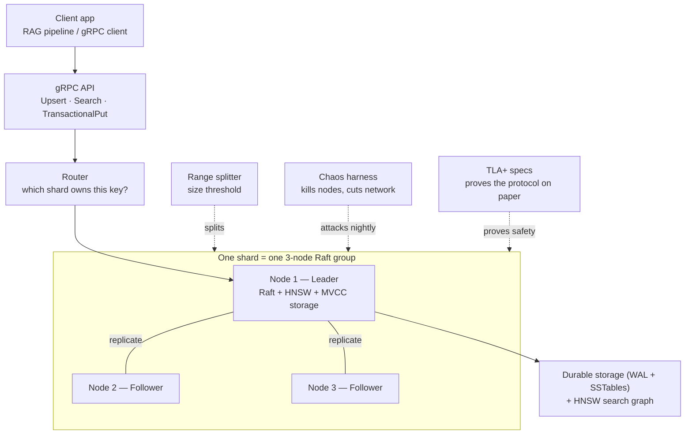

# Consensa

A distributed vector database, built from scratch in Go: a hand-written Raft consensus
implementation, a durable MVCC storage engine, an HNSW approximate-nearest-neighbor
index, cross-shard transactions, and a chaos-testing harness that attacks all of it with
real process kills and network partitions. No consensus library, no embedded database,
no vector-search library — the algorithms themselves are the project.

Every node in the diagrams below is a real OS process. Every claim in this README is
backed by a test that runs against real TCP sockets and real killed processes, not an
in-memory simulation standing in for one.

## What it does

Think of it as "Pinecone, but you can see every line of the replication logic." A client
sends a vector; three (or more) replicas agree on it via Raft, write it durably to disk,
and index it for nearest-neighbor search — so that killing any one replica's process
loses no data and drops no in-flight query.



A write only succeeds once a majority of a shard's replicas have durably logged it. A
read from the leader is always linearizable; a bounded-staleness read from a follower is
available once that replica holds a valid lease. Vector search is approximate by
construction (that's what makes it fast at scale) — it is never described as
linearizable, and the KV/metadata plane is the only part of this project that makes that
claim.

## Try it

```sh
./demo.sh
```

brings up a real 3-node cluster, upserts and searches vectors, commits a cross-range
transaction, kills a node's real process, shows the surviving majority still answers
correctly, then restarts the killed node and shows it recovers from its own on-disk log
-- printing real Prometheus metrics scraped from a live process at the end. It uses
[`cmd/democlient`](cmd/democlient), a small real gRPC client, not a mock.

Or run nodes by hand:

```sh
go run ./cmd/consensa -id 1 -peers "1=127.0.0.1:9001,2=127.0.0.1:9002,3=127.0.0.1:9003" \
  -data-dir /tmp/consensa1 -grpc-listen :8081 -metrics-listen :9091 -dimension 3
# repeat for -id 2 and -id 3 with their own --data-dir/--grpc-listen/--metrics-listen
```

or the whole cluster plus a live Grafana dashboard in one command:

```sh
docker compose -f deploy/docker-compose.yml --profile demo up --build
# Grafana: http://localhost:3000 (anonymous admin, demo-only) · Prometheus: :9090
docker compose -f deploy/docker-compose.yml kill consensa3   # kill a node live
docker compose -f deploy/docker-compose.yml up -d consensa3  # watch it recover
```

## What's actually proven

Every bullet below is backed by a specific, named test that runs against real replicas —
not asserted, not just "should work." The full account, including exactly what each test
does and doesn't cover, is in [`docs/correctness.md`](docs/correctness.md).

| Area | What's proven |
|---|---|
| **Consensus** | Hand-built Raft with pre-vote and the Figure 8 commit-safety rule, each closed by a scripted test that fails if the rule is weakened — not just "the happy path works." |
| **Durability** | A killed-and-restarted replica recovers its full state from its own on-disk log alone, before contacting a single peer — proven for both the vector index and the KV store. |
| **The shipped binary** | An end-to-end test builds the real `consensa` binary, runs three real OS processes, kills one mid-write, and checks the survivors and the recovered process over real gRPC. |
| **Chaos testing** | A seeded Python harness drives real partitions, process kills, and clock skew against real Raft clusters and checks the resulting history for linearizability (via [Porcupine](https://github.com/anishathalye/porcupine)) and search-result correctness. |
| **Cross-shard transactions** | A 2PC coordinator commits atomically across two independent 3-node Raft groups, reachable over a real gRPC call, and survives a coordinator crash mid-commit. |
| **Live range splits** | A shard splits into two fresh replica groups with no vector or key lost, duplicated, or leaking across the new boundary — proven on both the KV and vector planes, including publishing the new routing metadata atomically so both a fresh client and one holding a pre-split cached route resolve correctly afterward. Both planes now do this fully automatically inside the running binary, not just as a library primitive — real writes crossing a threshold trigger real child Raft groups standing up and taking over live traffic. |
| **Joint-consensus membership changes** | Adding, promoting, or removing a replica goes through Raft's two-phase joint-consensus protocol, so a disjoint old/new majority can never both elect a leader — the specific failure mode joint consensus exists to prevent is covered directly. This now includes provisioning a genuinely new, previously-unknown process, reachable over a real, optionally auth-gated `ConsensaAdmin` gRPC surface, not just an internal Go primitive. |
| **Read-path ladder** | Leader reads via a quorum-confirmed barrier (`ReadIndex`); follower reads via a replicated lease and closed timestamp, rejected until both are actually valid — not just modeled. |
| **Write-skew prevention** | The classic "two on-call doctors" anomaly is reproduced and the specific write that would complete it is rejected, on both the in-memory and Raft-replicated code paths; a transaction pushed by that check can also read-refresh and commit anyway instead of always aborting, proven on both paths too. |
| **Formal verification** | TLA+ models of joint-consensus quorum intersection and recursive range splitting, model-checked by TLC — each with a deliberately broken variant that must fail, so the checker itself is proven discriminating. |
| **Observability** | Real Prometheus metrics (Raft term, QPS, recall, and now the split-trigger recommendation) from a live process, rendered on an auto-provisioned Grafana dashboard, recall computed by an external client against an independent ground truth. |

`docs/bugs/` has a write-up for every real bug the test suite or chaos harness actually
found — root cause, fix, seed, regression test. `docs/adr/` records the design decisions,
including the ones later sessions overturned.

## What's inside

- **`internal/raft`** — Raft from the paper: pre-vote, the Figure 8 commit rule, snapshots,
  learners, and full joint-consensus membership changes, as a pure state machine with no
  goroutines or I/O inside the algorithm itself.
- **`internal/storage`** — an LSM-tree key/value engine: WAL, skiplist memtable, sorted
  SSTables, MVCC versioning by hybrid-logical-clock timestamp.
- **`internal/ann`** — HNSW, including the neighbor-selection heuristic that makes it
  outperform naive top-M graphs, plus the split-and-rebuild strategy that keeps search
  correct after a shard splits.
- **`internal/kv`** — range sharding, routing, and the split-trigger decision.
- **`internal/txn`** — HLC, write intents, a two-phase commit coordinator, and the
  timestamp-cache defense against write skew.
- **`api/consensa/v1`** — the gRPC contract: streaming `Upsert`/`Search`, `TransactionalPut`.
- **`harness/`** — the Python chaos-testing control plane and checkers.
- **`specs/`** — TLA+ models of the two hardest correctness properties.

## Known limits

Split and merge are both fully automatic now, on both planes, inside the running binary
— not library primitives you'd have to wire up yourself. Everything below is a real,
specific limit of the current design, not a vague disclaimer.

- **Split.** Once `kv.ShouldSplit`/`ann.ShouldSplit` recommends one, `cmd/consensa` stands
  up fresh child Raft groups on the shared transport, migrates data, and cuts traffic
  over live (`kv.ExecuteLiveSplit` / `ann.ExecuteLiveSplitByRepair`, exercised end-to-end
  by `TestConsensaBinaryExecutesALiveSplitAutomatically` and its vector-plane twin). The
  trigger fires on size or QPS (`--split-qps-threshold`, off by default), so a small but
  hot range can still split. The retired parent rejects every request instead of quietly
  serving stale data (`MarkRetired`, `ErrRangeKeyMismatch`) — that closes the
  silent-divergence risk, but it's not a zero-window guarantee across two processes'
  independently cached routes.
- **The vector split boundary is a lexicographic ID cut, not a clustering-aware one** —
  measured at a 37.7% relative recall hit right after a split
  (`docs/adr/011-vector-split-boundary.md`). Each child graph is rebuilt by one
  replicated, deterministic repair of the parent's structure (drop cross-boundary edges,
  backfill replacement neighbors) rather than reinserting every vector — recall lands
  within 5% of a full rebuild, at one Raft entry per child instead of one per vector
  (`docs/adr/012-replicated-incremental-repair.md`). A real clustering-aware boundary is
  still unbuilt.
- **Merge** (`docs/adr/014-live-range-merges.md`) reverses a split once both children go
  cold: `--merge-threshold` and `--merge-qps-threshold` gate it, the right child freezes
  through a Raft barrier, its data migrates into the left child's group, and it retires
  the same way a split parent does. Two things worth knowing before you rely on it —
  eligibility today only ever considers split-created sibling pairs, so the two original
  static ranges can never merge with anything; a write racing the freeze barrier can
  commit and then get silently discarded, which is the same "proposed isn't committed"
  contract every caller here already has to handle with a read-until-visible retry, not
  a new failure mode merge invented; and the migration itself isn't leadership-aware — it
  runs on whichever process performed the split, using that process's own local handle to
  the surviving range, so if Raft elects a different process to lead that range it just
  keeps retrying and failing until the existing leadership-affinity policy converges
  leadership back onto it, rather than failing over to whoever actually leads.
- **Membership changes** go through joint consensus end to end, including provisioning a
  genuinely new process over gRPC (`ConsensaAdmin.AddReplica`/`PromoteReplica`), and
  `consensa-cli join` scripts the add-then-promote sequence for you — though it still
  needs every replica's address by hand (no service discovery) and joins one range at a
  time. Every RPC across all three services can require a bearer token
  (`--auth-token`/`--admin-auth-token`, both off by default, scoped separately so a
  leaked data-plane token can't drive membership changes — see `docs/notes/13-auth.md`).
  There's no per-user identity, no token rotation, and no transport encryption on top of
  that.
- **Snapshot isolation** now read-refreshes instead of always aborting on a write-skew
  push, proven on both the in-memory and Raft-replicated stores. The closed timestamp
  advances and follower-read leases renew automatically on a running binary, but no RPC
  surface exposes follower reads to a client yet. A cross-range transaction still commits
  through a single process that leads every range it touches — there's no server-side
  forwarding — but which process that is no longer a coin flip: a leadership-transfer
  primitive plus a self-correcting affinity policy converges co-located groups onto the
  same preferred leader, closing the intermittent failure in `docs/bugs/003`.

See `docs/correctness.md` for the complete, current list.

## Verification

```sh
go build ./...
go vet ./...
go test -race -p 1 ./...
python3 -m pytest harness
```

Build plan: [`PLAN.md`](PLAN.md).
